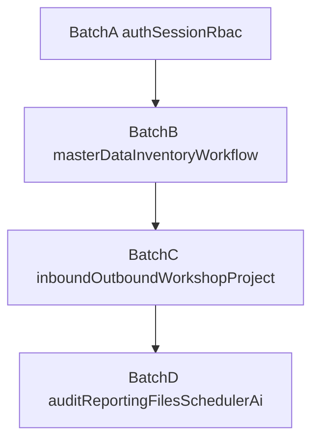

# Subagents 并行构建批次

## 0. 当前 Todo 状态

- [x] `批次 A`：已完成
- [x] `批次 B`：已完成（核心实现与补强闭环；DB-backed 集成测试深度待后续补强）
- [x] `批次 C`：已完成（当前门槛通过；DB-backed 单据流集成测试待后续补强）
- [x] `批次 D`：已完成（当前门槛通过；DB-backed Batch D 集成深度待后续补强）

## 1. 目标

在模块设计文档完成后，按照依赖层次而不是任意模块顺序启动 subagents，降低返工和跨模块接口漂移。

## 2. 前置条件

- `/docs/00-architecture-overview.md` 已确认
- 对应模块文档已完成并冻结边界
- 共享常量、状态码、单据类型码已在文档中显式列出
- 对于使用 raw SQL 的模块，关键查询已在文档中标注

## 3. 批次划分

### 批次 A：认证与权限底座

Todo 状态：已完成

- `auth`
- `session`
- `rbac`

前置条件：

- 全局异常、配置、Redis、JWT 基础设施准备完成
- 权限字符串命名规范确定

交付要求：

- 登录、退出、会话恢复、在线用户、路由树与权限集可闭环

### 批次 B：共享业务核心

Todo 状态：已完成（当前门槛通过；DB-backed 集成测试深度待后续补强）

- `master-data`
- `inventory-core`
- `workflow`

前置条件：

- 批次 A 完成
- Prisma 与事务包装可用
- 审核状态、库存日志、来源追踪语义冻结

交付要求：

- 主数据 CRUD、库存增减与逆操作、来源占用分配/释放、审核记录服务可被其他模块复用

### 批次 C：事务型单据

Todo 状态：已完成（当前门槛通过；DB-backed 单据流集成测试待后续补强）

- `inbound`
- `outbound`
- `workshop-material`
- `project`

前置条件：

- 批次 B 完成
- `inventory-core` 提供稳定应用服务
- `workflow` 提供统一审核接口

交付要求：

- 单据主从表事务、库存副作用、审核重置、下游校验全部落地

### 批次 D：外围与增强能力

Todo 状态：已完成（当前门槛通过；DB-backed Batch D 集成深度待后续补强）

- `audit-log`
- `reporting`
- `file-storage`
- `scheduler`
- `ai-assistant`

前置条件：

- A、B、C 至少完成核心接口
- 统计口径与审计事件格式已稳定

交付要求：

- 日志、报表、文件、任务、AI 编排可接入前面模块而不反向侵入领域边界

## 4. 推荐并行矩阵



## 5. 模块级前置依赖

- `auth` 依赖：`session`、`rbac`
- `session` 依赖：Redis、JWT
- `rbac` 依赖：用户/角色/菜单基础表、数据权限策略
- `master-data` 依赖：Prisma、字典查询
- `inventory-core` 依赖：`master-data`、事务服务、raw SQL 查询层
- `workflow` 依赖：`rbac`、共享审计字段
- `inbound` 依赖：`master-data`、`inventory-core`、`workflow`
- `outbound` 依赖：`master-data`、`inventory-core`、`workflow`
- `workshop-material` 依赖：`master-data`、`inventory-core`、`workflow`
- `project` 依赖：`master-data`、`inventory-core`
- `reporting` 依赖：`inventory-core`、`inbound`、`outbound`、`workshop-material`
- `audit-log` 依赖：认证事件、控制器拦截器
- `file-storage` 依赖：配置、静态资源映射
- `scheduler` 依赖：数据库任务表、执行器注册、日志表
- `ai-assistant` 依赖：`reporting`、`inventory-core`、`master-data`

## 6. 批次验收门槛

- 通用要求：所有批次提交前至少执行 `pnpm lint`；如需自动整理格式，执行 `pnpm format`
- 批次 A：完成 `auth/session/rbac` e2e 测试，并执行 `pnpm lint && pnpm test:e2e`
- 批次 B：完成库存与审核集成测试，并执行 `pnpm lint && pnpm test`
- 批次 C：完成单据流一致性测试，并执行 `pnpm lint && pnpm test`
- 批次 D：完成日志、报表、文件、任务、AI 接口联调，并执行 `pnpm lint && pnpm test`

## 7. 协作约束

- 每个 subagent 只能改动自己负责模块与共享契约文件
- 允许多个 writer 并行，但前提是写入范围在启动前已经显式声明且彼此不重叠
- 具备写权限的 subagent 不应以后台模式持续运行；如需并行 writer，应在同一轮启动并等待全部完成
- `src/app.module.ts`、`src/main.ts`、`src/shared/**`、`prisma/schema.prisma`、权限/路由注册表、跨模块测试、共享契约文档默认由父级 orchestrator 收口，除非明确指定唯一 owner
- 跨模块依赖必须通过文档中声明的接口调用
- 如需修改共享契约，先更新文档再重新分配批次
- 模块内事实文档由对应 `execution-agent` 维护；跨模块边界、事务归属、批次依赖文档由 `architecture-guardian` 把关或维护
- `docs/fix-checklists/` 由 `code-reviewer` 维护，不作为架构真相源
- `code-reviewer` 负责 review 结论、严重级别、gate 验收，以及相关 checklist/review 文档更新

## 8. 推荐 subagent 编组

### 批次 A 推荐编组

- 主执行：`execution-agent`
- 收尾校验：`code-reviewer`
- 如涉及 `shared/guards`、`shared/decorators`、会话票据语义变更，增加 `architecture-guardian`

### 批次 B 推荐编组

- 主执行：`execution-agent`
- 并行审查 / 契约规划：`architecture-guardian`
- 收尾校验：`code-reviewer`
- 若 `inventory-core` 或 `workflow` 暴露的新契约会被批次 C 复用，必须先冻结文档再继续实现

### 批次 C 推荐编组

- 主执行：`execution-agent`
- 只读支援 / 文档校准：`architecture-guardian`
- 收尾校验：`code-reviewer`
- 如需把 `inbound`、`outbound`、`workshop-material`、`project` 拆成多个 worker 并行，允许复制 `execution-agent` 角色，但所有 worker 必须共享同一份冻结契约

### 批次 D 推荐编组

- 主执行：`execution-agent`
- 边界审查 / 架构文档维护：`architecture-guardian`
- 收尾校验：`code-reviewer`
- `reporting`、`audit-log`、`scheduler` 如需并行推进，先确认只读模型、异步事件和执行日志格式不被改写

## 9. 启动前检查清单

每次启动新的批次或新的并行 worker 前，先逐项确认：

1. 对应模块设计文档已完成，且边界、状态码、关键字段命名已冻结
2. 上游批次已交付可复用应用服务，而不是“暂定接口”
3. 允许修改的目录、共享文件、测试范围已经写进任务描述
4. 需要保留的业务语义已经列明，例如库存唯一写入口、审核重置条件、会话票据模型
5. 最终验收命令已经提前指定，避免 subagent 只完成局部代码而未闭环验证
6. `code-reviewer` 需要负责对应批次的 integration-test 或 e2e 验收，而不只是静态 review
7. 如果会启动多个 writer，必须提前列出每个 writer 的 owned paths、forbidden shared files，以及由父级收口的共享文件

## 10. 标准任务下发模板

建议给每个 subagent 的任务描述至少包含以下内容：

```markdown
批次：
- `批次 B`

目标模块：
- `master-data`
- `inventory-core`
- `workflow`

冻结契约：
- `inventory-core` 是唯一库存写入口
- `workflow` 只管理审核投影与审核动作
- 不允许跨模块直接访问对方底表

允许改动：
- `src/modules/<owned-module>/**`
- 必要的共享事务封装、DTO 契约、测试文件

禁止改动：
- 未声明的其他模块内部 repository
- 未更新文档的共享常量与状态码
- 绕过应用层直接写库存或审核底表

必须回传：
- Summary
- Files or modules touched
- Contracts assumed or changed
- Tests run or still needed
- Risks or blockers
```

## 11. 并行执行中的暂停条件

出现以下情况时，应暂停当前批次的并行扩散，先回到文档或架构审查：

- 发现下游模块需要上游尚未稳定的共享接口
- 不同 subagent 对同一状态字段、权限码、单据关系表给出不同方案
- 某个 worker 试图跨模块直接查询或写入对方内部表
- 两个 writer 的 writable scope 实际发生重叠，或共享文件没有唯一 owner
- 为了通过测试而临时修改共享契约，但文档尚未同步
- `pnpm lint` 或关键集成测试暴露的是边界问题，而不是单点实现错误

## 12. Rules 与运行时上下文边界

- `.cursor/rules/*.mdc` 只记录长期稳定、可复用、应被未来任务继承的事实或约束
- 适合进入 rules 的内容：已验证的本地开发环境、冻结的编排规则、仓库级长期约束
- 不适合进入 rules 的内容：当前任务状态、临时 blocker、一次性测试失败、分支局部决策
- 父级 orchestrator 需要把运行时上下文放进 subagent handoff，或放入明确标注为临时的共享上下文载体，而不是直接提升为 rules
- 只有当某个观察被确认会跨任务长期成立，且不包含 secrets，才应从运行时上下文晋升为 rule

## 13. 当前建议执行顺序

基于当前 Todo 状态，`批次 A` 到 `批次 D` 均已完成。

后续如继续推进，建议顺序如下：

1. 优先补强 `批次 B`、`批次 C`、`批次 D` 的 DB-backed 集成测试深度，而不是继续扩散新的模块边界
2. 对 `reporting`、`scheduler`、`ai-assistant` 这类读多写少或平台型模块，优先补真实数据库口径、分页、时区与执行日志场景覆盖
3. 如需进入下一个阶段，应先冻结新增范围的架构文档、共享契约和验收门槛，再重新拆分批次

## 14. 交付完成定义

一个批次被视为“完成”，至少同时满足：

- 模块文档与实现没有明显漂移
- 对外复用的应用服务、DTO、状态码已稳定
- 该批次要求的测试已补齐并通过
- 下游批次可以在不修改上游内部实现的前提下继续推进

## 15. 批次收口与提交规则

当一个批次达到“完成”定义后，是否进入最终提交步骤，由父级 orchestration 显式判断，不由 hook 或文档清理 agent 自动触发。

用户意图解释规则：

- 如果用户说的是“继续构建某个批次”“完成某个批次”“交付某个批次”“不要停直到 batch 完成”这类表达，默认按“批次交付 / 完成请求”处理，而不是“允许先做一个增量切片再停”。
- 在这种请求下，完成一个模块、修好一个 slice、通过一次局部测试、产出 review/checklist，都只是中间里程碑，不是停点。
- 只有用户显式把范围缩小为 `review-only`、`docs-only`、`stop after this slice`、`no-commit`，或确实出现需要用户决策的真实 blocker，父级 orchestration 才能暂停。

如果父任务目标本身是“完成 / 交付 / 修完某个批次”，那么 `code-reviewer` 产出的 review markdown 或 `docs/fix-checklists/` 只是中间产物，不是终点。父级 orchestration 必须把未关闭的 `[blocking]` / `[important]` 项回流给 `execution-agent` 修复，并在必要时重复 review，直到满足收口条件并完成提交，或者出现需要用户决策的真实 blocker。

进入最终 commit skill 步骤之前，至少同时满足：

1. 对应批次要求的 gate 已执行并通过
2. `code-reviewer` 没有遗留未关闭的 `[blocking]` 或 `[important]` 项
3. 相关 `docs/fix-checklists/` 已由 `code-reviewer` 按证据更新，且当前作用域内没有仍应保留的未完成 actionable item
4. 不存在未解决的共享契约、模块边界或事务归属 blocker
5. 父任务本身就是该批次的交付 / 完成请求，或已明确允许在收口后创建 commit

职责划分：

- `execution-agent` 负责实现、补测、回传 closure evidence
- `execution-agent` 在其授权范围内维护模块事实文档
- `architecture-guardian` 在共享契约或跨模块边界风险存在时负责把关，并可在授权时规划或修订架构类文档
- `code-reviewer` 负责最终 review、严重级别判断、批次 gate 验收，以及 checklist 与 review 文档更新
- 只有父级 orchestrator 可以在全部条件满足后触发最终提交步骤
- 最终提交必须交给专门的 commit subagent 执行，并且该 subagent 必须使用 commit skill，因为提交规范、消息风格和安全约束由该 skill 统一定义

不建议的做法：

- 不要用 IDE hook 判断批次是否“完成”
- 不要让普通 worker subagent 在未经过收口判断时直接创建 commit
- 不要在父级 orchestrator 的最终收口阶段绕过 commit skill，直接手写 git 提交流程

推荐收口顺序：

1. `execution-agent`
2. `architecture-guardian`（如需要）
3. `code-reviewer`
4. 如仍有 `[blocking]` / `[important]` 项，回到 `execution-agent` 修复后重复 2-3
5. 父级 orchestrator 判断是否满足提交条件
6. 调用使用 commit skill 的 commit subagent 执行最终提交
