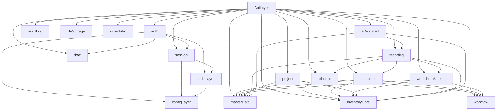

# NestJS 模块设计总览

## 1. 文档目标

本目录用于承接 `E:/Projects/saifute-wms-server` 到 NestJS 的模块化迁移设计。所有后续实现必须以这里的模块边界、依赖关系、事务约束和测试范围为准，避免 subagents 在实现阶段再次拆分领域。

便于清晰明确的了解项目架构

## 2. 源系统映射

- 平台层：`ruoyi-framework`、`ruoyi-system`、`ruoyi-common`、`ruoyi-quartz`、`ruoyi-admin`
- 业务层：`business/src/main/java/com/saifute/{base,stock,entry,out,take,article,audit,ai}`

## 3. 目标模块

### 业务域模块

业务域按职责分层，避免把「主数据 / 营运单据闭环 / 读模型与辅助」混在同一级列表里。详细流程与表口径以 `docs/architecture/20-wms-business-flow-and-optimized-schema.md` 为准。

#### 主数据域（主档与快照，不直接承担库存事务写）

- `master-data`：物料、客户、供应商、人员、车间；为事务单据提供主档与快照来源

#### 核心业务域（WMS 营运闭环：库存写路径 + 审核 + 单据家族）

共享写路径与审核：

- `inventory-core`：库存现值、库存日志、来源追踪、预警、编号区间；**全库库存唯一写入口**
- `workflow`：轻量审核记录与单据审核状态收口（`audit_document` 投影）

四类事务单据家族（各家族内可含多种业务单据类型，共用领域表与模块边界）：

- `inbound`：入库家族（验收单、生产入库单等）
- `customer`：客户收发家族（出库单、销售退货单等；对外路由前缀为 `/customer`）
- `workshop-material`：车间物料家族（领料、退料、报废等）
- `project`：项目/BOM、项目物料消耗等（默认轻审核或不走审核，以模块文档为准）

#### 分析与辅助域（不拥有事务写模型或仅只读/编排）

- `reporting`：首页统计、库存报表、跨域汇总查询；只读读模型，不替代业务单据与 `inventory-core` 写路径
- `ai-assistant`：SSE 对话、工具编排、页面跳转与预填；受控调用，不直接写业务数据

### 平台与横切模块

- `auth`：登录、验证码、认证入口、登录前置校验
- `session`：Redis 会话、在线用户、强退、滑动续期
- `rbac`：用户、角色、菜单、权限码、数据权限
- `audit-log`：登录日志、操作日志、审计字段
- `file-storage`：本地上传下载、头像、资源映射
- `scheduler`：数据库驱动的任务定义、调度、执行日志

## 3.1 目标技术栈

本节描述的是 NestJS 迁移阶段的目标选型基线，不等同于“当前仓库已安装依赖清单”。后续模块设计、subagent 实现和代码评审默认都以这套栈为准。

### 运行时与语言

- `Node.js LTS`：统一服务端运行时
- `TypeScript`：所有模块默认使用严格类型
- `NestJS`：统一模块化框架，承载 controller、guard、interceptor、provider、module 组织方式
- `pnpm`：包管理工具
- `Biome`：统一代码格式与静态检查工具，默认通过 `pnpm lint` 执行 `biome check .`
- `Husky`：统一 Git hooks 管理，依赖安装后通过 `prepare` 自动启用仓库级 hook
- `lint-staged`：提交前只检查暂存文件，减少全量 lint 带来的本地提交流程开销
- `commitlint`：统一提交信息校验，默认遵循 Conventional Commits 风格
- `Git hooks 分层门禁`：按 `pre-commit`、`commit-msg`、`pre-push` 分阶段拦截格式、说明和基础质量问题

### Web 与接口协议

- `REST API`：后台管理接口默认协议
- `SSE`：用于 `ai-assistant` 流式输出，必须兼容现有前端事件消费方式
- `DTO + class-validator/class-transformer`：统一请求校验、类型转换、输出约束

### 认证、会话与权限

- `JWT`：仅作为会话票据，不承载完整用户状态
- `Redis`：当前只承接登录会话、验证码、密码失败计数与在线会话扫描所需键空间；不借本轮接入扩展消息队列或通用缓存平台
- `NestJS Guards`：承载 `JwtAuthGuard`、`PermissionsGuard`、数据权限入口
- 自定义装饰器：统一 `@CurrentUser()`、`@Permissions()`、`@DataScope()`

### 数据访问

- `Prisma`：承接简单 CRUD、事务包装、基础 repository 能力
- `Raw SQL`：承接复杂报表、库存回溯、菜单权限联查、历史 SQL 口径保持
- 数据访问原则：简单查询优先 Prisma，复杂统计与高语义 SQL 保留手写查询，不强行 ORM 化

### 共享基础设施

- `shared/config`：集中管理环境变量、模块配置、密钥与开关；除 `shared/config` 外，其他模块不直接读取 `process.env`
- `shared/prisma`：统一 Prisma Client、事务封装、基础数据库访问入口
- `shared/redis`：统一 Redis 连接、键空间、JSON 序列化、TTL 与前缀扫描适配；当前只服务 `session` / `auth`
- `shared/common`：分页、响应模型、异常、常量、时间与精度辅助
- `shared/events`：模块间事件发布与审计事件桥接

### 业务与集成能力

- `inventory-core`：所有库存写入的唯一入口，封装库存、库存日志、来源追踪的事务能力
- `workflow`：第一阶段只兼容现有轻量审核模型，不引入 BPM 引擎
- `file-storage`：默认本地磁盘存储，保留 `/profile/**` 资源语义
- `scheduler`：保留数据库驱动任务定义，调度实现由 NestJS 基础设施承接
- `ai-assistant`：采用 OpenAI 兼容接口抽象 + 受控工具调用编排，不允许 AI 直接写业务数据

### 测试与质量门槛

- `Jest`：单元测试、集成测试、e2e 测试统一框架
- `Biome`：统一执行 lint 与 format 检查；提交前至少运行 `pnpm lint`，需要自动修复格式时运行 `pnpm format`
- `Husky + lint-staged`：当前仓库默认在 `pre-commit` 执行 `pnpm lint:staged`，仅校验暂存文件并应用 Biome 安全修复
- `commitlint`：当前仓库默认在 `commit-msg` 校验提交说明，提交信息需遵循如 `feat: ...`、`fix: ...`、`chore: ...` 的 Conventional Commits 约定
- `pre-push`：当前仓库默认在推送前执行 `pnpm verify`，覆盖 `pnpm typecheck && pnpm test`，在进入远端前拦截类型错误和基础回归
- 集成测试优先覆盖：认证会话、库存副作用、审核重置、单据逆操作、SSE 协议兼容
- 金额与数量字段默认采用高精度十进制策略，禁止直接依赖 JS `number` 做财务口径累计

### Git 提交流程建议

- `pre-commit`：处理“这次准备提交的文件有没有明显格式/静态检查问题”，反馈最快，适合只跑暂存文件
- `commit-msg`：处理“提交说明是否可读、可检索、可用于后续生成变更记录”，统一团队提交语义
- `pre-push`：处理“准备推到远端的代码是否至少能通过类型检查和基础测试”，避免把低级错误推上仓库
- 分层原则：越靠前的 hook 越轻量，越靠后的 hook 越偏完整校验，平衡开发速度和质量门槛

### 选型边界

- 不切换为纯无状态 JWT
- 不强行把复杂报表改写成 Prisma 查询
- 不在第一阶段引入 BPM、消息队列、微服务拆分
- 不在第一阶段升级为完整仓库/库位/批次 WMS 模型

## 4. 统一代码结构

每个 NestJS 模块统一采用以下分层：

```text
modules/<module>/
  controllers/
  application/
  domain/
  infrastructure/
  dto/
```

约束如下：

- `controllers` 只处理协议转换、权限注解、DTO 校验
- `application` 负责用例编排、事务边界、调用多个聚合
- `domain` 只放领域规则、状态变更、校验
- `infrastructure` 负责 Prisma repository、raw SQL query、Redis、文件、调度适配
- `dto` 只定义接口输入输出，不承载业务逻辑
- 当前仓库同时承载后端与前端代码；前端工程位置统一为仓库根目录下的 `web/`，本地工作区与协作路径不再引用旧的独立前端仓库路径

## 5. 共享基础设施

- `shared/config`：环境变量、配置注册、模块级配置对象
- `shared/prisma`：Prisma Client、事务包装、基础 Repository
- `shared/redis`：会话、验证码、密码失败计数与在线会话扫描的统一 Redis 边界；不在本轮扩展为消息队列或通用缓存平台
- `shared/common`：响应模型、分页、异常、常量
- `shared/guards`：`JwtAuthGuard`、`PermissionsGuard`
- `shared/interceptors`：`AuditLogInterceptor`、响应包装、超时控制
- `shared/decorators`：`@Permissions()`、`@CurrentUser()`、`@DataScope()`
- `shared/events`：认证事件、审计事件、任务执行事件

### 5.1 Redis 真实接入契约

职责边界：

- `AppConfigService`：统一读取并解析 `REDIS_*` 连接参数；除 `shared/config` 外，其他模块不直接读取 `process.env`
- `RedisModule`：维护唯一 Redis 客户端生命周期；应用启动阶段必须完成连接与探测，失败时记录明确错误并阻止服务继续启动
- `RedisStoreService`：继续作为 `session` / `auth` 的唯一 Redis 访问入口，负责 JSON 序列化、TTL 兼容与前缀扫描适配，不把客户端特定返回值或异常语义直接泄漏给上层

`REDIS_*` 约定：

| 环境变量 | 默认值 | 说明 |
| --- | --- | --- |
| `REDIS_HOST` | `127.0.0.1` | 本地开发 Redis 主机 |
| `REDIS_PORT` | `6379` | 本地开发 Redis 端口 |
| `REDIS_PASSWORD` | 空 | Redis 密码；本地默认允许留空 |
| `REDIS_DB` | `0` | 连接使用的 Redis 数据库编号 |
| `REDIS_CONNECT_TIMEOUT_MS` | `5000` | 启动连接与探测的超时上限 |

连接与扫描约束：

- 真实 Redis 在应用启动阶段接管；若连接或 `PING` 探测失败，进程必须 fail fast，不允许静默回退到进程内 `Map`
- `listByPrefix` 的真实实现必须基于增量扫描策略，不允许使用 `KEYS`
- 当前 Redis 范围只覆盖已经依赖 `RedisStoreService` 的 `session` / `auth` 能力，不新增其他产品语义

键空间索引：

| 归属模块 | 键模式 | 载荷 | TTL / 生命周期 |
| --- | --- | --- | --- |
| `session` | `login_tokens:{sid}` | `UserSession` | 初始 TTL 使用 `SESSION_TTL_SECONDS`；滑动续期时不得超过 `SESSION_MAX_TTL_SECONDS` |
| `auth` | `auth:captcha:{captchaId}` | `{ captchaCode }` | 使用 `CAPTCHA_TTL_SECONDS`；校验成功或失败后均视为一次性消费 |
| `auth` | `auth:password-attempt:{username}` | `{ count, lockedUntil? }` | 按 `PASSWORD_LOCK_MINUTES` 折算秒级 TTL，登录成功后立即清理 |

## 6. 数据访问策略

- 简单 CRUD 优先使用 Prisma
- 复杂列表、库存计算、统计报表、菜单/权限联查优先保留 raw SQL
- 事务型单据必须通过应用层显式控制事务
- 不允许业务模块直接跨模块查询对方底表；必须通过公开应用服务或查询服务访问

## 7. 关键语义冻结

- 认证模式保持“JWT 票据 + Redis 会话”，不切纯无状态 JWT
- Redis 不可用时服务必须启动失败；不允许以内存实现或降级模式继续提供 `session` / `auth`
- 权限模型保持“菜单/按钮权限字符串 + 数据权限”组合
- `workflow` 第一阶段只兼容当前 `audit_document` 审核模型，不引入 BPM 引擎
- `inventory-core` 必须保留库存日志和 `inventory_used` 来源追踪
- 文件存储默认保留本地磁盘和 `/profile/**` 资源语义
- 调度保留“数据库定义任务 + 执行日志”产品形态

## 8. 模块依赖总图



## 9. 文档使用约定

后续 subagents 实现时必须遵守：

- 先完成共享核心模块，再实现依赖模块
- 每个模块只根据对应文档实现，不擅自新增领域边界
- 若发现源系统语义与文档冲突，应先补文档再编码
- 单据模块的库存、副作用、审核重置必须写进集成测试
- 涉及业务流程、状态机和优化表设计时，以 `docs/architecture/20-wms-business-flow-and-optimized-schema.md` 为冻结基线

## 10. 推荐阅读顺序

0. `docs/architecture/20-wms-business-flow-and-optimized-schema.md`
1. `auth`
2. `session`
3. `rbac`
4. `master-data`
5. `inventory-core`
6. `workflow`
7. `inbound`
8. `customer`
9. `workshop-material`
10. `project`
11. `audit-log`
12. `reporting`
13. `file-storage`
14. `scheduler`
15. `ai-assistant`
