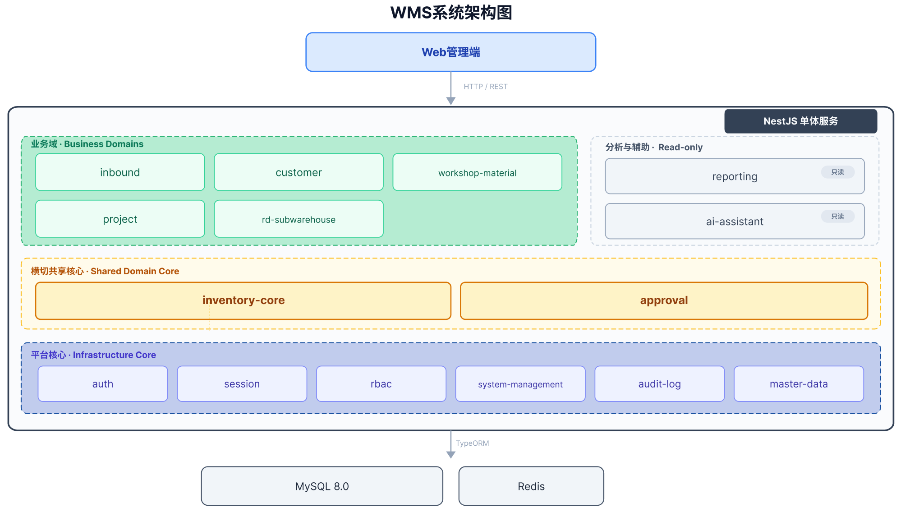
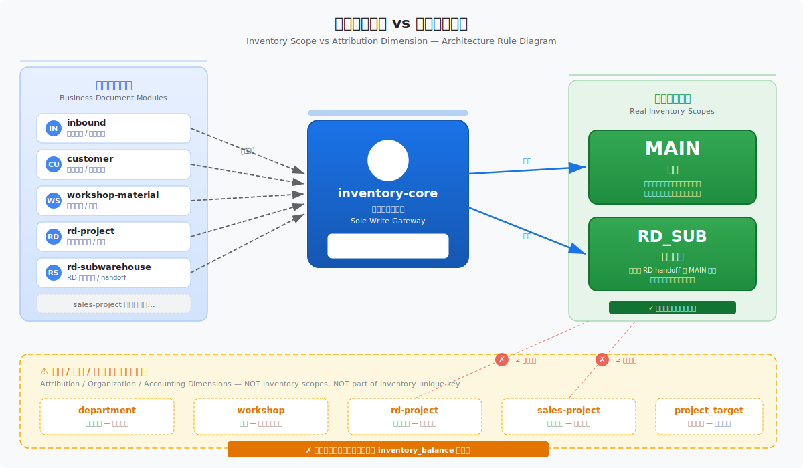
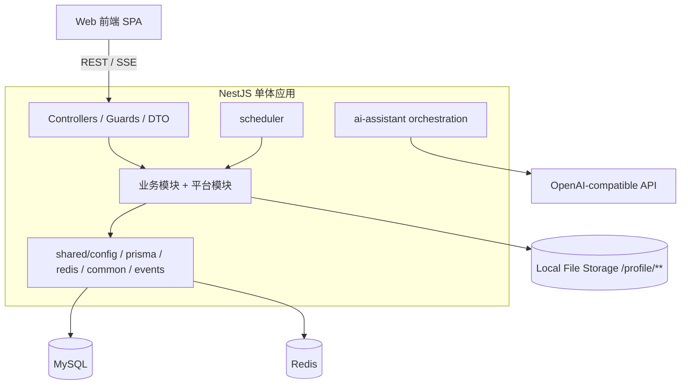
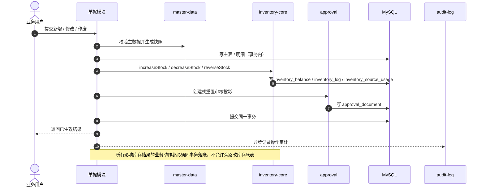
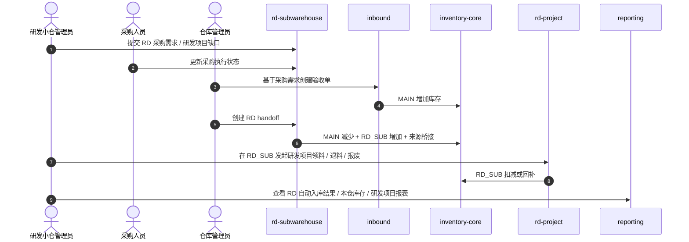
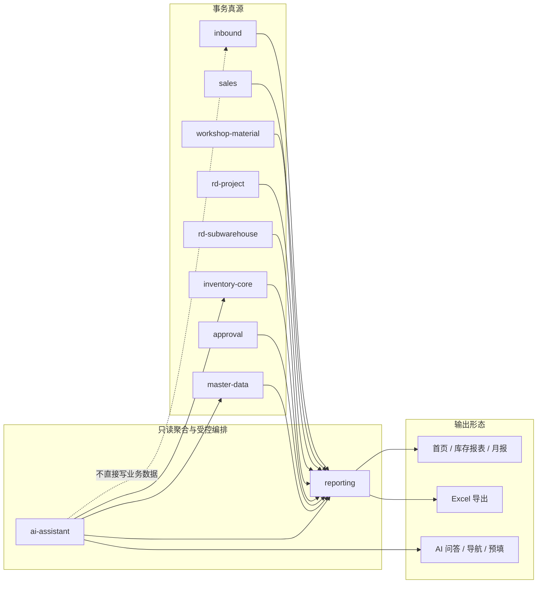
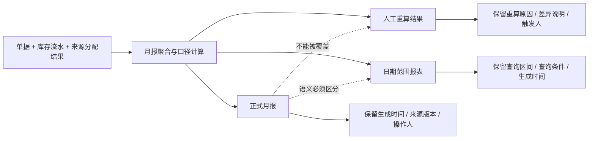
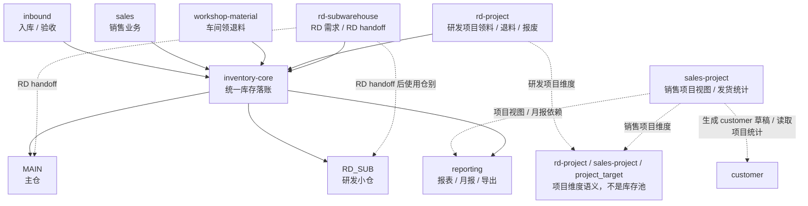

# 架构视图与设计图

## 1. 文档目标

本文件基于以下长期真源做一次面向实现与评审的架构复核，并补齐图形化表达：

- `docs/requirements/PROJECT_REQUIREMENTS.md`
- `docs/requirements/domain/*.md`
- `docs/architecture/00-architecture-overview.md`
- `docs/architecture/20-wms-database-tables-and-schema.md`
- `docs/architecture/modules/*.md`

它不是第二份架构真源，也不替代 `00-*` 与 `20-*` 的正文基线；它只是把“需求约束 -> 架构边界 -> 实现落点”的关系压缩成一组可复用的架构视图，供以下场景直接引用：

- 新模块设计 review
- 需求评审时确认边界
- 实现前统一上下文
- PR review 时校验是否破坏已冻结语义

### 1.1 文档边界

| 文档 | 角色 | 记录什么 | 不记录什么 | 冲突时以谁为准 |
| --- | --- | --- | --- | --- |
| `00-architecture-overview.md` | 总览基线 | 模块清单、技术栈、共享基础设施、冻结约束、总依赖关系 | 大量派生图、逐需求 review 展开、模块级细节 | `00` 自身及更下游的 schema / requirement 真源 |
| `10-architecture-views.md` | 派生视图 | 图形化架构视图、需求到架构的映射、review 观察点 | 新增独立规则、改写 schema baseline、替代模块文档 | `docs/requirements/**`、`00-*`、`20-*`、`modules/*.md` |

维护约束：

- 若只是想补图、补 review 视角或把复杂边界讲清楚，优先更新本文件，不再新增新的顶层架构文档。
- 若未来真的出现新的长期真源层，例如新的数据库基线、迁移基线或部署基线，再单独新开文档。

## 2. 图谱覆盖清单

下表用于对齐 `docs/architecture/11-nanobanana-architecture-image-prompts.md` 中要求优先维护的架构图，确保本文件中的“代码优先简图”覆盖完整，不遗漏关键边界：

| 来源图名 | 当前代码简图位置 | 状态 | 说明 |
| --- | --- | --- | --- |
| 系统全景与模块分层图 | `3.1` | 已覆盖 | 对应单体分层、共享核心、业务域、只读辅助层 |
| 库存真实范围与归属维度分离图 | `3.2` | 已覆盖 | 冻结 `MAIN / RD_SUB` 与 `department / workshop / rd-project / sales-project` 的边界 |
| RD 小仓协同与 RD handoff 图 | `3.5` | 已覆盖 | 明确 “先入 `MAIN`，再 `RD handoff`，最终在 `RD_SUB` 使用” |
| 库存事务写路径图 | `3.4` | 已覆盖 | 冻结 `inventory-core` 为唯一库存写入口 |
| 报表与 AI 只读聚合图 | `3.6` | 已覆盖 | 冻结 `reporting` / `ai-assistant` 的只读与受控辅助定位 |
| 运行时容器与基础设施图 | `3.3` | 已覆盖 | 明确 `NestJS` 单体、`MySQL`、`Redis`、本地文件、外部 AI 接口 |
| 对外汇报版业务闭环总览图 | `3.8` | 已覆盖 | 面向管理沟通的业务闭环总览 |

补充说明：

- `3.7 月报结果生命周期图` 是在上述 7 张目标图之外追加的实现约束图，用于冻结月报正式结果、人工重算结果、日期范围报表三类语义分离。
- 因此，若以 `11-*` 作为对照基线，本文件当前已补齐全部目标架构图；后续新增图应建立在这套覆盖关系之上，而不是替代它。

## 3. 架构图

### 3.1 系统全景与模块分层图

结构说明：

- 本图表达的是 `NestJS` 单体下的模块化分层，不是按模块独立部署的微服务架构。
- 顶部是 `Web 管理端`，统一通过后端接口进入系统，不直接触达数据库或底层存储。
- 中间的“平台与共享核心”承接认证、会话、权限、审计、主数据、库存与审核等横切能力，是所有业务模块的公共底座。
- 下方的“业务域模块”承接入库、销售业务、车间领退料、研发项目、RD 小仓等具体业务流程，按领域拆分实现，但共享同一套核心能力；销售项目当前仍处于独立真源设计阶段。
- 右侧或下侧的“分析与辅助层”包括 `reporting` 与 `ai-assistant`，用于查询、导出、解释、导航与预填，不直接写业务事实。

复核重点：

- `inventory-core` 是所有库存写入的唯一入口，业务模块不能旁路改库存结果。
- `approval` 是轻量共享审核域，只承接审核投影，不替代业务主状态。
- `reporting` 是只读聚合层，面向报表与导出，不拥有事务写模型。
- `ai-assistant` 是受控辅助能力，只能查询、解释和辅助录入，不能直接提交业务事实。

### 3.2 库存真实范围与归属维度分离图

结构说明：

- 本图表达的是一条架构规则，不是业务流程：库存唯一键只包含仓别（`MAIN` / `RD_SUB`），其余维度不进入库存唯一键。
- 左侧是所有会触发库存变动的业务单据模块：`inbound`、`customer`、`workshop-material`、`rd-project`、`rd-subwarehouse`；它们统一通过 `inventory-core` 写入库存。
- 右侧是仅有的两个真实库存落点：`MAIN` 主仓和 `RD_SUB` 研发小仓。
- 底部黄色虚线区域列出 `department`、`workshop`、`rd-project`、`sales-project`、`project_target` —— 这些是组织归属或核算维度，不是库存池，不进入 `inventory_balance` 的唯一键。

复核重点：

- 系统中仅存在 `MAIN` 和 `RD_SUB` 两个真实库存范围，不允许出现第三个物理仓。
- `workshop` 是领料归属维度，不持有独立库存余额。
- `rd-project` 和 `sales-project` 是核算维度，不是库存池；研发项目领用虽然固定在 `RD_SUB`，但项目本身不构成独立仓别。
- 所有库存写入必须经过 `inventory-core`，单据模块不能旁路改库存底表。

### 3.3 运行时容器图

复核重点：

- 运行时仍是“单体应用 + MySQL + Redis + 本地文件 + 外部 AI 接口”的结构，不在第一阶段引入消息队列、微服务或数仓。
- `Redis` 只承接会话、验证码、密码失败计数等已确认范围，不扩成通用缓存平台。
- `ai-assistant` 是受控编排组件，不是系统事实真源。

### 3.4 库存事务写路径时序图

复核重点：

- 单据主表、明细、库存现值、库存流水、来源追踪、审核投影优先同事务提交。
- 审计日志允许异步，但主业务事实与库存副作用不能拆事务。
- `approval` 是横切投影，不替代业务主状态，也不替代库存事实。

### 3.5 RD 小仓协同时序图

复核重点：

- 外部实物到货仍统一先入主仓，`RD_SUB` 只通过主仓交接得到真实库存。
- `RD handoff` 不只是数量搬运，还必须桥接来源与成本关系，确保后续研发项目成本不断链。
- 研发项目实际使用仓别固定为 `RD_SUB`，这与“项目不是物理库存池”并不冲突。

### 3.6 报表与 AI 的只读聚合图

复核重点：

- `reporting` 是从事务真源派生出的读模型，不拥有事务写模型。
- `ai-assistant` 只能通过受控工具调用查询、解释、导航和预填，不直接提交库存或单据事实。
- 月报、销售项目报表、研发项目成本报表、RD 统计面都应在这个只读层内扩展，而不是回写业务真源。

### 3.7 月报结果生命周期图

复核重点：

- 这张图直接对应月报需求里的三类结果分离原则：正式月报、人工重算、日期范围报表。
- 报表是衍生统计结果，不是库存或单据主数据来源。
- 当前 `reporting` 模块尚未完整实现这条目标链路，但该结构应作为后续扩展基线，不再回退为“临时查询 + 导出即月报”。

### 3.8 对外汇报版业务闭环总览图

复核重点：

- 这张图面向老板、管理层或跨部门沟通，强调的是业务闭环和统一落账点，不展开实现细节。
- 所有库存变化统一经过 `inventory-core`，真实库存实体仍只有 `MAIN` 与 `RD_SUB`。
- `rd-project` 与 `sales-project` 都不是独立库存池；这条边界在对外汇报场景也不能为了“好懂”而被画错。

## 4. 后续维护规则

- 任何会改变“库存真实范围”“库存唯一写入口”“RD 协同链”“项目是否为库存池”“报表/AI 是否只读”这几条主边界的改动，都应同步更新本文件。
- 若后续进入开放式多仓、库位、批次、BPM、多级审批、消息队列或数仓架构，必须新开专门架构切片，不在本文件上做隐式渐进式漂移。
- 若只是模块内部实现细节变化，但未改变这些冻结边界，应优先更新对应 `modules/*.md`，不必改动本文件。
