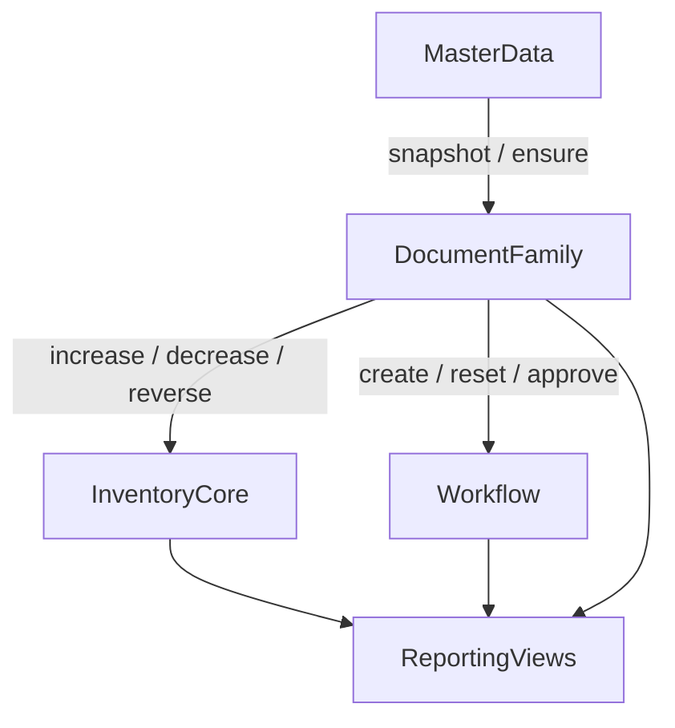

# WMS 业务流程与优化表设计

## 1. 文档目标

本文件用于在 `docs/architecture/00-architecture-overview.md` 的模块边界之上，进一步冻结：

- 共享核心与事务单据的业务流程
- 优化后的逻辑数据模型
- 面向 MySQL 的首版物理表设计原则
- `Prisma` 与 `migration.sql` 的落地方向

该文档解决的问题是：原 Java 设计可能把主数据、库存副作用、审核状态、单据字段混杂在一起，导致模块职责和表职责不清。NestJS 版本统一按领域重构，不直接照搬旧表。

## 2. 设计原则

### 2.1 边界冻结

- `master-data` 只负责主数据与快照查询，不直接维护库存或审核状态
- `inventory-core` 是唯一库存写入口，单据模块不能绕过它直接改库存
- `workflow` 只负责审核投影与审核动作，不替代业务单据主状态
- `reporting` 只做读模型与汇总查询，不拥有事务写模型

### 2.2 单据建模原则

- 不设计“一张超级单据表 + 一张超级明细表”
- 按业务家族拆为入库、客户收发、车间物料、项目四类写模型
- 单据表只保存业务事实和必要快照
- 库存日志、来源追踪、编号区间、审核状态下沉到共享核心

### 2.3 状态设计原则

库存型单据不再依赖一个混杂的 `status` 字段，而是拆成三条状态轴：

- `lifecycleStatus`：`EFFECTIVE`、`VOIDED`
- `auditStatusSnapshot`：`NOT_REQUIRED`、`PENDING`、`APPROVED`、`REJECTED`
- `inventoryEffectStatus`：`POSTED`、`REVERSED`

其中：

- 单据主状态由业务模块维护
- 审核状态以 `workflow_audit_document` 为准，单据表仅保留快照字段方便列表查询
- 库存副作用状态由 `inventory-core` 控制

### 2.4 事务原则

- 单据主表、明细、库存现值、库存流水、来源追踪、审核投影优先同事务提交
- 修改单据必须按明细差量处理，不允许“直接覆盖旧明细”
- 作废必须走逆操作，不允许直接改回库存结果
- 审计日志允许异步，但主业务事实和库存副作用不能拆事务

## 3. 业务流程总览

## 4. 共享核心业务流程

### 4.1 `master-data`

主流程：

1. 维护物料、客户、供应商、人员、车间主档
2. 为单据提供标准查询与快照能力
3. 在被明确允许时，为历史兼容场景执行受控自动补建

关键约束：

- 作废优先逻辑停用，不物理删除
- 物料停用前必须校验库存余额和未完成业务引用
- 自动补建必须记录来源单据和来源操作人
- 单据只读取快照，不直接耦合主数据内部表结构

### 4.2 `inventory-core`

主流程：

1. 根据单据命令执行 `increaseStock()` 或 `decreaseStock()`
2. 同事务写入 `inventory_balance` 与 `inventory_log`
3. 如涉及消耗来源，维护 `inventory_source_usage`
4. 如涉及出厂编号区间，维护 `factory_number_reservation`
5. 作废时通过 `reverseStock()` 生成逆向流水并释放占用

关键约束：

- `inventory-core` 是库存唯一写入口
- 库存现值与库存日志必须同时存在
- `inventory_source_usage` 与逆操作补偿不可省略
- 幂等通过 `idempotencyKey` 保证，避免重复写库存

### 4.3 `workflow`

主流程：

1. 单据创建后创建或刷新 `workflow_audit_document`
2. 审核执行通过、拒绝、重置等动作
3. 单据修改后是否重置审核由业务模块决定，但统一由 `workflow` 落表
4. 作废前通过查询服务校验下游依赖和审核约束

关键约束：

- 仅兼容三态审核：待审、通过、拒绝
- 审核记录是横切投影，不替代业务单据主状态
- 审核表不直接持有库存逻辑
- 审核模块不直接反向写业务单据，只返回明确结果

## 5. 单据家族业务流程

### 5.1 入库家族

范围：

- `stock_in_order`：验收单、生产入库单
- `stock_in_order_line`

流程：

1. 校验供应商、经办人、车间、物料等主数据
2. 写主表与明细
3. 调用 `inventory-core.increaseStock()`
4. 创建或刷新审核记录
5. 修改时按明细差量重算库存并重置审核
6. 作废时调用 `reverseStock()` 冲回已入库结果

### 5.2 客户收发家族

范围：

- `customer_stock_order`：出库单、销售退货单
- `customer_stock_order_line`

流程：

1. 出库时校验库存充足、客户主数据、编号区间
2. 销售退货时校验来源出库关系和可退数量
3. 写主表与明细
4. 调用 `inventory-core.decreaseStock()` 或 `increaseStock()`
5. 对出库行维护 `factory_number_reservation`
6. 通过 `document_relation`、`document_line_relation` 表达退货与出库上下游关系
7. 作废时逆操作库存并释放编号区间

历史迁移补充：

- 在线运行时仍可保持“销售退货创建时优先校验来源出库关系”的策略。
- 但历史迁移首批允许销售退货在无法证明上游关系时先进入正式业务表，行内 `sourceDocumentType/sourceDocumentId/sourceDocumentLineId` 可为空。
- 后续再通过共享关系增强阶段补 `document_relation`、`document_line_relation` 与可证明的行内来源字段。

### 5.3 车间物料家族

范围：

- `workshop_material_order`：领料单、退料单、报废单
- `workshop_material_order_line`

流程：

1. 领料、报废走 `decreaseStock()`
2. 退料走 `increaseStock()`
3. 对消耗类动作维护 `inventory_source_usage`
4. 通过单据关系表表达退料对领料的回冲关系
5. 作废时执行逆操作并释放来源占用

历史迁移补充：

- 在线运行时仍可保持“退料优先校验来源领料关系”的策略。
- 但历史迁移首批允许退料在无法证明上游领料关系时先进入正式业务表，行内 `sourceDocumentType/sourceDocumentId/sourceDocumentLineId` 可为空。
- 后续再通过共享关系增强与来源追踪补录阶段恢复可证明的关系和 `inventory_source_usage` 释放链。

审核策略补充：

- `workshop_material_order.auditStatusSnapshot` 在表结构上默认按 `PENDING` 处理
- 若某类 `orderType` 明确不走审核，由应用层在创建时显式写入 `NOT_REQUIRED`

### 5.4 项目家族

范围：

- `project`
- `project_material_line`

流程：

1. 创建项目主表与项目物料明细
2. 根据物料差量调用 `inventory-core` 维护消耗或回补
3. 默认不接 `workflow`，`auditStatusSnapshot` 固定为 `NOT_REQUIRED`
4. 作废项目时回补库存，并保留项目历史事实

## 6. 优化后的逻辑数据模型

## 6.1 `master-data` 表

| 表名 | 说明 | 关键字段 | 关键约束 |
| --- | --- | --- | --- |
| `material_category` | 物料分类树 | `categoryCode`、`categoryName`、`parentId` | `categoryCode` 唯一 |
| `material` | 物料主档 | `materialCode`、`materialName`、`specModel`、`categoryId`、`unitCode`、`warningMinQty`、`warningMaxQty`、`status` | `materialCode` 唯一 |
| `customer` | 客户主档 | `customerCode`、`customerName`、`parentId`、`status` | `customerCode` 唯一 |
| `supplier` | 供应商主档 | `supplierCode`、`supplierName`、`status` | `supplierCode` 唯一 |
| `personnel` | 人员主档 | `personnelCode`、`personnelName`、`status` | `personnelCode` 唯一 |
| `workshop` | 车间主档 | `workshopCode`、`workshopName`、`status` | `workshopCode` 唯一 |

补充说明：

- 自动补建不单独拆交易表，先在主数据主表保留 `creationMode`、`sourceDocumentType`、`sourceDocumentId` 追溯来源
- 物料分类与主数据字典分离，不把分类字段直接塞进 `material`
- 第一阶段不把客户、供应商、人员强行并表为通用主体

## 6.2 `inventory-core` 表

| 表名 | 说明 | 关键字段 | 关键约束 |
| --- | --- | --- | --- |
| `inventory_balance` | 物料库存现值 | `materialId`、`workshopId`、`quantityOnHand`、`rowVersion` | `materialId + workshopId` 唯一 |
| `inventory_log` | 不可变库存流水 | `balanceId`、`direction`、`operationType`、`businessDocumentType`、`businessDocumentId`、`changeQty`、`beforeQty`、`afterQty`、`idempotencyKey` | `idempotencyKey` 唯一 |
| `inventory_source_usage` | 消耗来源追踪 | `materialId`、`sourceLogId`、`consumerDocumentType`、`consumerDocumentId`、`consumerLineId`、`allocatedQty`、`releasedQty` | `consumerDocumentType + consumerLineId + sourceLogId` 唯一 |
| `factory_number_reservation` | 出厂编号区间占用 | `materialId`、`businessDocumentType`、`businessDocumentId`、`businessDocumentLineId`、`startNumber`、`endNumber`、`status` | 单据行与区间组合唯一 |

补充说明：

- 第一阶段库存维度固定为 `materialId + workshopId`
- 对历史上“没有明确车间”的单据，迁移阶段统一归档到默认车间
- `inventory_warning` 不落交易表，改为读模型视图 `vw_inventory_warning`

## 6.3 `workflow` 表

| 表名 | 说明 | 关键字段 | 关键约束 |
| --- | --- | --- | --- |
| `workflow_audit_document` | 审核投影表 | `documentFamily`、`documentType`、`documentId`、`documentNumber`、`auditStatus`、`submittedBy`、`decidedBy`、`resetCount` | `documentType + documentId` 唯一 |

补充说明：

- 审核表只保存当前有效审核状态
- 审核动作的细粒度日志继续落 `audit-log`
- `workflow` 不和单据表建立多态外键，避免跨模块强耦合

## 6.4 单据写模型表

| 表名 | 说明 | 关键字段 | 关键约束 |
| --- | --- | --- | --- |
| `stock_in_order` | 验收单、生产入库单主表 | `documentNo`、`orderType`、`supplierId`、`handlerPersonnelId`、`workshopId`、三轴状态 | `documentNo` 唯一 |
| `stock_in_order_line` | 入库明细 | `orderId`、`lineNo`、`materialId`、`quantity`、`unitPrice`、`amount` | `orderId + lineNo` 唯一 |
| `customer_stock_order` | 出库单、销售退货单主表 | `documentNo`、`orderType`、`customerId`、`handlerPersonnelId`、`workshopId`、三轴状态 | `documentNo` 唯一 |
| `customer_stock_order_line` | 客户收发明细 | `orderId`、`lineNo`、`materialId`、`quantity`、`unitPrice`、`amount`、`startNumber`、`endNumber` | `orderId + lineNo` 唯一 |
| `workshop_material_order` | 领料、退料、报废主表 | `documentNo`、`orderType`、`workshopId`、`handlerPersonnelId`、三轴状态 | `documentNo` 唯一 |
| `workshop_material_order_line` | 车间物料明细 | `orderId`、`lineNo`、`materialId`、`quantity`、`unitPrice`、`amount` | `orderId + lineNo` 唯一 |
| `project` | 项目主表 | `projectCode`、`projectName`、`customerId`、`supplierId`、`managerPersonnelId`、三轴状态 | `projectCode` 唯一 |
| `project_material_line` | 项目物料明细 | `projectId`、`lineNo`、`materialId`、`quantity`、`unitPrice`、`amount` | `projectId + lineNo` 唯一 |
| `document_relation` | 表头级上下游关系 | `relationType`、`upstreamFamily`、`upstreamDocumentId`、`downstreamFamily`、`downstreamDocumentId` | 关系组合唯一 |
| `document_line_relation` | 行级上下游关系 | `relationType`、`upstreamLineId`、`downstreamLineId`、`linkedQty` | 关系组合唯一 |

补充说明：

- 销售退货与出库、退料与领料优先通过关系表表达，不在主表上堆砌大量特化字段
- 单据行保留物料编码、名称、规格、单位等快照，避免历史口径被主数据修改污染
- 项目域虽然是事务型领域，但第一阶段不接 `workflow`
- 对历史迁移数据，`customer_stock_order_line` 与 `workshop_material_order_line` 的 `sourceDocument*` 可作为可空增强字段处理；formal-row admission 先完成，关系与来源追踪后补

## 6.5 只读视图

首版建议直接在 MySQL 中落只读视图，而不是再造统计交易表：

- `vw_inventory_warning`
- `vw_document_summary`
- `vw_document_line_summary`

用途：

- 统一 `reporting` 的查询口径
- 减少报表层直接拼接多张主从表和库存表的复杂度
- 让导出与首页统计可以依赖稳定 SQL 视图

## 7. 统一字段规范

### 7.1 通用审计字段

所有核心表与单据表统一包含：

- `createdBy`
- `createdAt`
- `updatedBy`
- `updatedAt`

作废型表另外包含：

- `voidedBy`
- `voidedAt`
- `voidReason`

### 7.2 快照字段

所有事务单据明细统一保留：

- `materialCodeSnapshot`
- `materialNameSnapshot`
- `materialSpecSnapshot`
- `unitCodeSnapshot`

有主体信息的表头按需保留：

- `customerCodeSnapshot`
- `customerNameSnapshot`
- `supplierCodeSnapshot`
- `supplierNameSnapshot`
- `handlerNameSnapshot`
- `workshopNameSnapshot`

### 7.3 精度规范

- 数量统一 `decimal(18,6)`
- 金额统一 `decimal(18,2)`
- 不使用浮点类型承载库存与财务口径

## 8. MySQL 约束与索引策略

### 8.1 必须落物理唯一键的约束

- 主数据编码唯一
- 单据编号唯一
- 主从表 `parentId + lineNo` 唯一
- `inventory_balance(materialId, workshopId)` 唯一
- `inventory_log.idempotencyKey` 唯一
- `workflow_audit_document(documentType, documentId)` 唯一

### 8.2 需要应用层补充的约束

- 出厂编号区间不重叠
- 作废前下游依赖校验
- 单据修改时的差量计算
- 负库存策略

### 8.3 查询索引建议

- 单据主表：`bizDate`、`orderType`、`customerId` 或 `supplierId`、`workshopId`
- 单据明细：`materialId`
- 库存流水：`businessDocumentType + businessDocumentId`、`occurredAt`
- 关系表：`upstreamDocumentId`、`downstreamDocumentId`
- 审核表：`auditStatus`、`documentFamily`

## 9. Prisma 与迁移落地建议

### 9.1 `schema.prisma`

模型分组：

- 枚举：主数据状态、单据状态、库存方向、操作类型、关系类型
- 共享核心：`Material`、`InventoryBalance`、`WorkflowAuditDocument`
- 单据家族：`StockInOrder`、`CustomerStockOrder`、`WorkshopMaterialOrder`、`Project`
- 关系与只读协作：`DocumentRelation`、`DocumentLineRelation`

### 9.2 首批迁移

建议首批迁移文件：

- `prisma/migrations/20260314_core_business_schema/migration.sql`

首批只做：

- 共享核心表
- 四类单据家族主从表
- 上下游关系表
- 三个读视图

暂不做：

- 旧库兼容视图
- 历史数据导入脚本
- 复杂统计物化表

## 10. 实施顺序

1. 先落 `master-data`、`inventory-core`、`workflow`
2. 再落四类单据家族主从表
3. 然后补 `document_relation`、`document_line_relation`
4. 最后补 `reporting` 只读视图与 query service

## 11. 冻结结论

- 共享核心必须先定型，再让单据模块依赖
- 单据按家族建模，不再复刻原 Java 的零散表设计
- 库存、审核、来源追踪、编号区间从单据表中剥离
- 物理表按 MySQL 设计，Prisma 作为简单 CRUD 与事务入口，复杂报表继续保留 SQL 视图与查询服务
