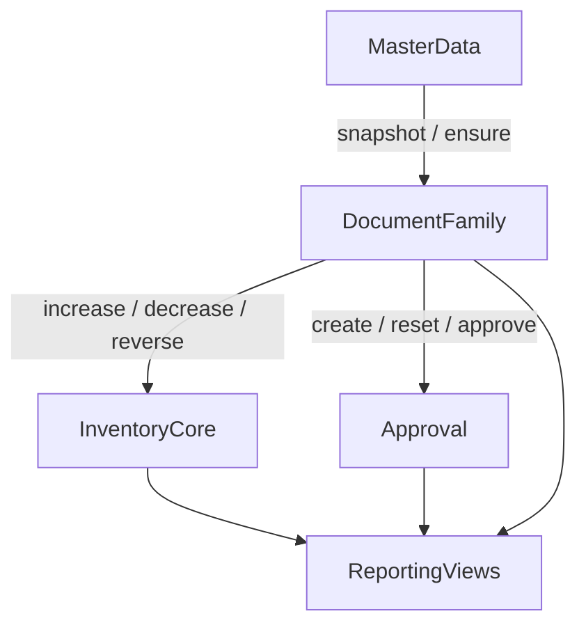

# WMS 数据库表与 Schema 说明

## 1. 文档目标

本文件用于在 `docs/architecture/00-architecture-overview.md` 的模块边界之上，进一步冻结：

- 共享核心与事务单据对应的数据库表与 `Prisma` 模型
- 优化后的逻辑数据模型
- 面向 MySQL / Prisma 的物理表设计原则
- 这些表背后的关键业务流程与状态语义
- `Prisma` 模型与数据结构映射口径

该文档解决的问题是：原 Java 设计可能把主数据、库存副作用、审核状态、单据字段混杂在一起，导致模块职责和表职责不清。NestJS 版本统一按领域重构，不直接照搬旧表。

范围说明：

- 本文件聚焦 `master-data`、`inventory-core`、`approval` 与各事务单据家族的运行态数据库表。
- 不覆盖平台层辅助持久化表；这类表应在对应模块架构文档中说明，而不是混入业务表基线。

## 2. 设计原则

### 2.1 边界冻结

- `master-data` 只负责主数据与快照查询，不直接维护库存或审核状态
- `inventory-core` 是唯一库存写入口，单据模块不能绕过它直接改库存
- `approval` 只负责审核投影与审核动作，不替代业务单据主状态
- `reporting` 只做读模型与汇总查询，不拥有事务写模型

### 2.2 单据建模原则

- 不设计“一张超级单据表 + 一张超级明细表”
- 按业务家族拆为入库、销售业务、车间物料、研发项目四类写模型；销售项目目标上单独成域，不复用研发项目写模型
- 单据表只保存业务事实和必要快照
- 库存日志、来源追踪、编号区间、审核状态下沉到共享核心

### 2.3 状态设计原则

库存型单据不再依赖一个混杂的 `status` 字段，而是拆成三条状态轴：

- `lifecycleStatus`：`EFFECTIVE`、`VOIDED`
- `auditStatusSnapshot`：`NOT_REQUIRED`、`PENDING`、`APPROVED`、`REJECTED`
- `inventoryEffectStatus`：`POSTED`、`REVERSED`

其中：

- 单据主状态由业务模块维护
- 审核状态以 `approval_document` 为准，单据表仅保留快照字段方便列表查询
- 库存副作用状态由 `inventory-core` 控制

### 2.4 事务原则

- 单据主表、明细、库存现值、库存流水、来源追踪、审核投影优先同事务提交
- 修改单据必须按明细差量处理，不允许“直接覆盖旧明细”
- 作废必须走逆操作，不允许直接改回库存结果
- 审计日志允许异步，但主业务事实和库存副作用不能拆事务

### 2.5 库存范围与归属分离原则

- 实物库存范围与业务归属维度必须分离，不能让一个字段同时承担“货放在哪”和“算到谁头上”
- 第一阶段真实库存范围只承接 `MAIN`（主仓）与 `RD_SUB`（研发小仓）
- `workshop` 只承担主仓领料、退料、报废的归属与成本核算，不建立车间库存余额
- `rd-project` 只承担研发项目，不直接等同库存池；`sales-project` 只承担销售项目视图与统计，也不是库存池
- 同一物料不同入库批次允许存在不同成本层，出库、领料、退料必须按来源分配传递成本

## 3. 业务流程总览

### 3.1 当前 NestJS 模块与单据家族映射

本章正文按“单据家族 / 共享核心”来写，而不是按 controller 名称来写。为避免阅读时误以为 `inbound` 缺席，先补一张“模块 -> 表 -> 单据家族”的阅读映射表：

| NestJS 模块           | 路由前缀                 | 覆盖对象   | 对应核心表                                                                                     | 说明                                     |
| ------------------- | -------------------- | ------ | ----------------------------------------------------------------------------------------- | -------------------------------------- |
| `master-data`       | `/master-data`       | 主数据    | `material_category`、`material`、`customer`、`supplier`、`personnel`、`workshop`、`stock_scope` | 为事务单据提供主档、归属维度与真实库存范围                  |
| `inventory-core`    | `/inventory`         | 库存核心   | `inventory_balance`、`inventory_log`、`inventory_source_usage`、`factory_number_reservation`、`project_target` | 库存唯一写入口                                |
| `approval`       | `/approval`       | 审核投影   | `approval_document`                                                              | 代码/API/Prisma/DB canonical 名称；单据表只保留审核快照 |
| `inbound`           | `/inbound`           | 入库家族   | `stock_in_order`、`stock_in_order_line`                                                    | `orders` 对应验收单，`into-orders` 对应生产入库单   |
| `sales`          | `/sales`             | 销售业务家族 | `sales_stock_order`、`sales_stock_order_line`                                        | `orders` 对应销售出库单，`sales-returns` 对应销售退货单 |
| `workshop-material` | `/workshop-material` | 车间物料家族 | `workshop_material_order`、`workshop_material_order_line`                                  | `pick` / `return` / `scrap` 共用一套主从表    |
| `rd-project`         | `/rd-projects`       | 研发项目家族  | `rd_project`、`rd_project_bom_line`、`rd_project_material_action`、`project_target`       | 当前运行时已独立为 `RdProject*` 与 `rd_project*`；销售项目目标语义见 `docs/architecture/modules/sales-project.md` |
| `reporting`         | `/reporting`         | 只读报表   | 读取事务表与视图                                                                                  | 不拥有事务写模型                               |

补充说明：

- 因此本文第 `5.1` 节“入库家族”就是当前 NestJS 的 `inbound` 模块设计口径，不是遗漏。
- **成品入库**（生产完工入库）统一走 `inbound`（生产入库单），与验收单共表；产品「生产车间」页面与业务划分应基于 `master-data.workshop`，而不是系统管理中的 `department`。`workshop` 主档仍表示归属/核算维度，与 `workshop-material`（领退料报废）边界分离。
- NestJS 按“模块聚合 + 家族共表”组织接口，而不是按 Java 的“每类单据一套 controller + 一套表”复刻。

## 4. 共享核心业务流程

### 4.1 `master-data`

主流程：

1. 维护物料、客户、供应商、人员、车间、库存范围主档
2. 为单据提供标准查询与快照能力
3. 在被明确允许时，为历史兼容场景执行受控自动补建

关键约束：

- 作废优先逻辑停用，不物理删除
- 物料停用前必须校验库存余额和未完成业务引用
- 自动补建必须记录来源单据和来源操作人
- 单据只读取快照，不直接耦合主数据内部表结构

### 4.2 `inventory-core`

主流程：

1. 根据单据命令和目标 `stockScopeId` 执行 `increaseStock()` 或 `decreaseStock()`
2. 同事务写入 `inventory_balance` 与 `inventory_log`
3. 如涉及消耗来源，维护 `inventory_source_usage` 并记录来源成本层分配
4. 如涉及出厂编号区间，维护 `factory_number_reservation`
5. 作废时通过 `reverseStock()` 生成逆向流水并释放占用

关键约束：

- `inventory-core` 是库存唯一写入口
- 库存现值与库存日志必须同时存在
- `inventory_source_usage` 与逆操作补偿不可省略
- 真实库存范围与 `workshop` / `rd-project` / `sales-project` 归属必须分离
- 同一物料不同来源批次可保留不同成本层，出库成本必须通过来源分配传递
- 幂等通过 `idempotencyKey` 保证，避免重复写库存

### 4.3 `approval`

主流程：

1. 单据创建后创建或刷新 `approval_document`
2. 审核执行通过、拒绝、重置等动作
3. 单据修改后是否重置审核由业务模块决定，但统一由 `approval` 落表
4. 作废前通过查询服务校验下游依赖和审核约束

关键约束：

- 仅兼容三态审核：待审、通过、拒绝
- 审核记录是横切投影，不替代业务单据主状态
- 审核表不直接持有库存逻辑
- 审核模块不直接反向写业务单据，只返回明确结果

## 5. 单据家族业务流程

### 5.1 入库家族

范围：

- `stock_in_order`：验收单、生产入库单
- `stock_in_order_line`

流程：

1. 校验供应商、经办人、库存范围、车间、物料等主数据
2. 写主表与明细
3. 调用 `inventory-core.increaseStock()`
4. 创建或刷新审核记录
5. 修改时按明细差量重算库存并重置审核
6. 作废时调用 `reverseStock()` 冲回已入库结果

NestJS `inbound` 模块映射补充：

- `/inbound/orders` 对应 `StockInOrderType.ACCEPTANCE`，即验收单
- `/inbound/into-orders` 对应 `StockInOrderType.PRODUCTION_RECEIPT`，即生产入库单
- 两类单据共用 `stock_in_order` / `stock_in_order_line`，差异通过 `orderType`、权限前缀、应用服务入口区分
- 第一阶段验收单与生产入库单默认写入主仓 `MAIN`；RD 采购到货在验收时也先入主仓，再由后续协同过账转入 RD 小仓

入库调价单（计划中）：

- `stock_in_price_correction_order`：入库调价单
- `stock_in_price_correction_order_line`

流程：

1. 选择原入库来源流水（`inventory_log.id`），填写正确单价
2. 审核时重新锁定并计算原来源流水的剩余数量和已消费数量
3. 对剩余数量：生成 `PRICE_CORRECTION_OUT` 流水（强制从原来源分配）+ `PRICE_CORRECTION_IN` 流水（按正确单价转入）
4. `inventory_balance.quantityOnHand` 净变化为零，原来源可用量归零，新转入流水成为后续 FIFO 来源
5. 对已消费部分：只记录历史差异金额，不改历史消费链和 `inventory_source_usage`
6. 不允许对同一原来源流水存在多张未作废、未完成的调价单

### 5.2 销售业务家族

范围：

- `sales_stock_order`：出库单、销售退货单
- `sales_stock_order_line`

流程：

1. 出库时校验库存充足、客户主数据、编号区间
2. 销售退货时校验来源出库关系和可退数量
3. 写主表与明细
4. 销售出库调用 `inventory-core.settleConsumerOut()`，销售退货调用 `increaseStock()`
5. 对出库行维护 `factory_number_reservation`
6. 通过 `document_relation`、`document_line_relation` 表达退货与出库上下游关系
7. 作废时逆操作库存并释放编号区间

NestJS `sales` 模块映射补充：

- 模块 canonical 命名、对外路由前缀与权限码统一为 `sales`
- `/sales/orders` 对应 `SalesStockOrderType.OUTBOUND`，即出库单
- `/sales/sales-returns` 对应 `SalesStockOrderType.SALES_RETURN`，即销售退货单
- 两类单据共用 `sales_stock_order` / `sales_stock_order_line`
- 销售退货与出库的来源关系优先通过 `document_relation`、`document_line_relation` 表达，而不是继续拆独立关系表
- 第一阶段销售出库与销售退货默认作用于主仓 `MAIN`

价格层出库：

- 出库时用户按 `物料 + 价格层 + 数量` 录单，价格只能从当前有库存的价格层中选择
- 价格层可用库存口径：按 `物料 + stockScope + unitCost` 聚合现有可用来源流水得到，不新建独立价格库存余额主表
- 来源流水的成本层真源是 `inventory_log.unitCost`；入库类单据把入库明细 `unitPrice` 固化为来源流水成本快照
- 销售出库行使用 `selectedUnitCost` 记录用户选定的库存价格层；`unitPrice` 保持对客户的业务销售单价口径，不是库存成本价，也不承载库存成本层语义
- 系统在用户选定的价格层内部自动按 FIFO 分配到具体来源，写入 `inventory_source_usage`
- 出库过账后将实际来源分配汇总为 `costUnitPrice` / `costAmount`，作为该出库行的历史成本快照

历史数据兼容补充：

- 在线运行时仍可保持“销售退货创建时优先校验来源出库关系”的策略。
- 历史迁移数据在无法证明上游关系时，行内 `sourceDocumentType/sourceDocumentId/sourceDocumentLineId` 可为空。

### 5.3 车间物料家族

范围：

- `workshop_material_order`：领料单、退料单、报废单
- `workshop_material_order_line`

流程：

1. 领料、报废走对主仓 `MAIN` 的 `decreaseStock()`
2. 退料走对主仓 `MAIN` 的 `increaseStock()`
3. `workshopId` 只用于归属与成本核算，不建立车间库存余额
4. 车间领料 / 报废行的 `unitPrice / amount` 是内部成本核算口径，不是销售价；对消耗类动作维护 `inventory_source_usage`
5. 通过单据关系表表达退料对领料的回冲关系
6. 退料在线运行时应尽量绑定原领料行，以价格对齐和回补追溯为主；若无法可靠匹配，允许无源退料，但不得伪造关系
7. 报废可选引用领料或其他上游关系，但该关系仅用于来源追溯与成本分析，不改变报废作为独立事务的统计口径
8. 作废时执行逆操作并释放来源占用

历史数据兼容补充：

- 历史迁移数据在无法证明上游领料关系时，行内 `sourceDocumentType/sourceDocumentId/sourceDocumentLineId` 可为空。

审核策略补充：

- 车间物料默认走轻审核，审核记录只用于追溯、说明和责任留痕
- 审核不阻断单据创建、库存过账和实时查询；已过账即视为业务生效
- `workshop_material_order.auditStatusSnapshot` 可按 `PENDING` 或 `NOT_REQUIRED` 落快照，具体由应用层决定，但不改变即时过账口径

车间汇总口径补充：

- `净耗用` 是车间维度只读核算指标，不落事务写模型字段
- 默认计算公式为 `已过账领料 - 已过账退料 + 已过账报废`
- 统计时仅纳入已过账且未作废的单据，轻审核状态不影响纳入时点
- 净耗用专项只读页统一由 `reporting` / 月报承接，`workshop-material` 页面不另建第二套独立口径页

NestJS `workshop-material` 模块映射补充：

- `/workshop-material/pick-orders` 对应 `WorkshopMaterialOrderType.PICK`
- `/workshop-material/return-orders` 对应 `WorkshopMaterialOrderType.RETURN`
- `/workshop-material/scrap-orders` 对应 `WorkshopMaterialOrderType.SCRAP`
- 三类车间物料单据共用 `workshop_material_order` / `workshop_material_order_line`，由 `orderType` 和库存方向决定业务语义

### 5.4 项目家族

范围：

- `rd_project`
- `rd_project_material_line`

流程：

1. 创建项目主表与项目物料明细
2. 与 RD 小仓有关的领用、退料、报废默认对 `RD_SUB` 调用 `inventory-core`，研发项目只承担内部项目语义
3. 默认不接 `approval`，`auditStatusSnapshot` 固定为 `NOT_REQUIRED`
4. 作废项目时回补库存，并保留项目历史事实

NestJS `rd-project` / `reporting` 模块映射补充：

- `/rd-projects` 逻辑上对应 `RdProject*`，物理上对应 `rd_project*`
- `/reporting` 不拥有单独事务表，统一读取四类单据家族、库存表与只读视图
- 因此研发项目域是独立写模型，而报表域是独立读模型，两者不应在实现上混成一个“统计增强版研发项目模块”

## 6. 优化后的逻辑数据模型

### 6.1 数据表总表

| 所属模块                | 名称                             | 类型  | 说明                 |
| ------------------- | ------------------------------ | --- | ------------------ |
| `master-data`       | `material_category`            | 表   | 物料分类               |
| `master-data`       | `material`                     | 表   | 物料主档               |
| `master-data`       | `customer`                  | 表   | 客户主档               |
| `master-data`       | `supplier`                     | 表   | 供应商主档              |
| `master-data`       | `personnel`                    | 表   | 人员主档               |
| `master-data`       | `workshop`                     | 表   | 车间主档（归属 / 核算维度）    |
| `master-data`       | `stock_scope`                  | 表   | 库存范围主档（主仓 / RD 小仓） |
| `inventory-core`    | `inventory_balance`            | 表   | 库存现值               |
| `inventory-core`    | `inventory_log`                | 表   | 库存流水               |
| `inventory-core`    | `inventory_source_usage`       | 表   | 来源分配 / 释放追踪        |
| `inventory-core`    | `factory_number_reservation`   | 表   | 出厂编号区间占用           |
| `approval`       | `approval_document`   | 表   | 审核投影表              |
| `inbound`           | `stock_in_order`               | 表   | 入库家族主表，承载验收单与生产入库单 |
| `inbound`           | `stock_in_order_line`          | 表   | 入库家族明细             |
| `inbound`           | `stock_in_price_correction_order`      | 表   | 入库调价单主表（计划中）       |
| `inbound`           | `stock_in_price_correction_order_line` | 表   | 入库调价单明细（计划中）       |
| `sales`          | `sales_stock_order`         | 表   | 销售业务主表，承载销售出库单与销售退货单 |
| `sales`          | `sales_stock_order_line`    | 表   | 销售业务明细             |
| `workshop-material` | `workshop_material_order`      | 表   | 车间物料主表，承载领料、退料、报废  |
| `workshop-material` | `workshop_material_order_line` | 表   | 车间物料明细             |
| `rd-project`        | `rd_project`                   | 表   | 研发项目主表             |
| `rd-project`        | `rd_project_material_line`     | 表   | 研发项目物料明细           |
| `cross-document`    | `document_relation`            | 表   | 表头级上下游关系           |
| `cross-document`    | `document_line_relation`       | 表   | 行级上下游关系            |
| `audit-log`         | `sys_logininfor`               | 表   | 登录日志               |
| `audit-log`         | `sys_oper_log`                 | 表   | 操作日志               |
| `scheduler`         | `sys_job`                      | 表   | 定时任务定义             |
| `scheduler`         | `sys_job_log`                  | 表   | 定时任务执行日志           |
| `reporting`         | `vw_inventory_warning`         | 视图  | 库存预警读模型            |
| `reporting`         | `vw_document_summary`          | 视图  | 单据汇总读模型            |
| `reporting`         | `vw_document_line_summary`     | 视图  | 单据行汇总读模型           |

补充说明：

- `session` 当前走 `Redis`，不落单独 MySQL 业务表。
- `auth`、`rbac`、`file-storage`、`ai-assistant`、`reporting` 主要提供认证、路由、文件、AI、报表读接口，不额外拥有新的事务写模型表。

## 6.2 `master-data` 表

| 表名                  | 说明    | 关键字段                                                                                                       | 关键约束               |
| ------------------- | ----- | ---------------------------------------------------------------------------------------------------------- | ------------------ |
| `material_category` | 物料分类 | `categoryCode`、`categoryName`、`sortOrder`                                                                   | `categoryCode` 唯一  |
| `material`          | 物料主档  | `materialCode`、`materialName`、`specModel`、`categoryId`、`unitCode`、`warningMinQty`、`warningMaxQty`、`status` | `materialCode` 唯一  |
| `customer`       | 客户主档  | `customerCode`、`customerName`、`contactPerson`、`contactPhone`、`address`、`parentId`、`status`                    | `customerCode` 唯一  |
| `supplier`          | 供应商主档 | `supplierCode`、`supplierName`、`status`                                                                     | `supplierCode` 唯一  |
| `personnel`         | 人员主档  | `personnelName`、`status`                                                                                   | —                  |
| `workshop`          | 车间主档  | `workshopName`、`defaultHandlerPersonnelId`、`status`                                                       | `workshopName` 唯一 |
| `stock_scope`       | 库存范围  | `scopeCode`、`scopeName`、`scopeType`、`status`                                                               | `scopeCode` 唯一     |

补充说明：

- 自动补建不单独拆交易表，但只保留在 `material`、`customer`、`supplier` 三张主表；`personnel`、`workshop` 不保留来源追溯字段
- 物料分类与主数据字典分离，不把分类字段直接塞进 `material`
- 客户、供应商、人员保持分表，不并表为通用主体
- `stock_scope` 用于表达主仓、研发小仓等真实库存范围，不等同标准 WMS 的仓库 / 库位体系
- `workshop` 只用于单据归属与成本核算，不承担库存余额维度

## 6.3 `inventory-core` 表

| 表名                           | 说明       | 关键字段                                                                                                                                                                          | 关键约束                                                     |
| ---------------------------- | -------- | ----------------------------------------------------------------------------------------------------------------------------------------------------------------------------- | -------------------------------------------------------- |
| `inventory_balance`          | 物料库存现值   | `materialId`、`stockScopeId`、`quantityOnHand`、`rowVersion`                                                                                                                     | `materialId + stockScopeId` 唯一                           |
| `inventory_log`              | 不可变库存流水  | `balanceId`、`stockScopeId`、`bizDate`、`direction`、`operationType`、`businessDocumentType`、`businessDocumentId`、`changeQty`、`beforeQty`、`afterQty`、`unitCost`、`costAmount`、`idempotencyKey` | `idempotencyKey` 唯一                                      |
| `inventory_source_usage`     | 消耗来源追踪   | `materialId`、`sourceLogId`、`consumerDocumentType`、`consumerDocumentId`、`consumerLineId`、`allocatedQty`、`releasedQty`、`status`                    | `consumerDocumentType + consumerLineId + sourceLogId` 唯一 |
| `factory_number_reservation` | 出厂编号区间占用 | `materialId`、`businessDocumentType`、`businessDocumentId`、`businessDocumentLineId`、`startNumber`、`endNumber`、`status`                                                          | 单据行与区间组合唯一                                               |

补充说明：

- 第一阶段真实库存范围固定为 `MAIN` 与 `RD_SUB`
- 对历史上无法明确判定库存范围的数据，默认归到 `MAIN`；确需留痕时使用受控历史兜底范围，而不是默认车间
- `inventory_balance` 仅以 `stockScopeId` 作为真实库存维度，`workshop` 归属直接落在 `inventory_log.workshopId` 与关联单据字段中
- `inventory_log` 强制记录 `bizDate`（业务日期），月度出入库统计与跨模块时段分析必须以此为准
- `projectId` 只用于研发项目逻辑模型，不直接等同库存池；当前仍映射 legacy `projectId` 物理列
- 未来若落地销售项目，销售出库 / 退货侧应显式使用 `salesProjectId` 及对应项目快照字段，不与 `rd_project*` 复用同名字段
- 同一物料不同来源批次允许不同成本层；入库类成本写入 `inventory_log.unitCost` / `costAmount`，出库类成本由 `inventory_source_usage.sourceLogId` 回连来源流水后汇总
- `inventory_warning` 不落交易表，改为读模型视图 `vw_inventory_warning`

## 6.4 `approval` 表

| 表名                        | 说明    | 关键字段                                                                                                               | 关键约束                           |
| ------------------------- | ----- | ------------------------------------------------------------------------------------------------------------------ | ------------------------------ |
| `approval_document` | 审核投影表 | `documentFamily`、`documentType`、`documentId`、`documentNumber`、`auditStatus`、`submittedBy`、`decidedBy`、`resetCount` | `documentType + documentId` 唯一 |

补充说明：

- 审核表只保存当前有效审核状态
- 审核动作的细粒度日志继续落 `audit-log`
- `approval` 不和单据表建立多态外键，避免跨模块强耦合
- 数据库 cutover 后只保留 `approval_document` 作为当前审核投影真源；历史 SQL / migration 需同步改到 canonical 名称

## 6.5 `inbound` 表

| 表名                    | 说明          | 关键字段                                                                                        | 关键约束                  |
| --------------------- | ----------- | ------------------------------------------------------------------------------------------- | --------------------- |
| `stock_in_order`      | 验收单、生产入库单主表 | `documentNo`、`orderType`、`stockScopeId`、`supplierId`、`handlerPersonnelId`、`workshopId`、三轴状态 | `documentNo` 唯一       |
| `stock_in_order_line` | 入库明细        | `orderId`、`lineNo`、`materialId`、`quantity`、`unitPrice`、`amount`                             | `orderId + lineNo` 唯一 |

补充说明：

- `StockInOrderType.ACCEPTANCE` 与 `StockInOrderType.PRODUCTION_RECEIPT` 共用同一套主从表
- `inbound` 模块里的验收单与生产入库单只是在应用层入口不同，不再拆成两套独立表
- 第一阶段验收单与生产入库单默认写入主仓 `MAIN`
- 修改时必须按明细差量处理，不允许直接覆盖旧明细后忽略库存补偿

### 入库调价单（计划中）

| 表名                                       | 说明     | 关键字段                                                                                                                                   | 关键约束                                            |
| ---------------------------------------- | ------ | -------------------------------------------------------------------------------------------------------------------------------------- | ----------------------------------------------- |
| `stock_in_price_correction_order`        | 入库调价单主表 | `documentNo`、`stockScopeId`、`workshopId`、三轴状态、`totalLineCount`、`totalHistoricalDiffAmount`                                              | `documentNo` 唯一                                 |
| `stock_in_price_correction_order_line`   | 入库调价单明细 | `orderId`、`lineNo`、`materialId`、`sourceInventoryLogId`、`wrongUnitCost`、`correctUnitCost`、`consumedQtyAtCorrection`、`remainingQtyAtCorrection`、`historicalDiffAmount`、`generatedOutLogId`、`generatedInLogId` | `orderId + lineNo` 唯一；`sourceInventoryLogId` 唯一限制同一来源仅一张有效调价单 |

补充说明：

- 调价单不复用 `stock_in_order`，是独立单据家族
- `wrongUnitCost` 记录原来源流水上的错误成本，`correctUnitCost` 记录本次确认后的正确成本
- `consumedQtyAtCorrection` 和 `remainingQtyAtCorrection` 必须在审核时重新锁定并计算，不使用制单时缓存值
- `historicalDiffAmount = (correctUnitCost - wrongUnitCost) × consumedQtyAtCorrection`
- `generatedOutLogId` / `generatedInLogId` 与 `inventory_log` 闭环，审核过账后填写

## 6.6 `sales` 表

| 表名                          | 说明          | 关键字段                                                                                      | 关键约束                  |
| --------------------------- | ----------- | ----------------------------------------------------------------------------------------- | --------------------- |
| `sales_stock_order`      | 出库单、销售退货单主表 | `documentNo`、`orderType`、`stockScopeId`、`customerId`、`handlerPersonnelId`、三轴状态            | `documentNo` 唯一       |
| `sales_stock_order_line` | 销售业务明细      | `orderId`、`lineNo`、`materialId`、`quantity`、`unitPrice`、`amount`、`selectedUnitCost`、`costUnitPrice`、`costAmount`、`startNumber`、`endNumber` | `orderId + lineNo` 唯一 |

补充说明：

- `SalesStockOrderType.OUTBOUND` 与 `SalesStockOrderType.SALES_RETURN` 共用同一套主从表
- 销售退货与出库的主关系优先通过关系表表达，不在主表持续堆砌特化字段
- `unitPrice` / `amount` 是业务销售金额；`selectedUnitCost` 是用户选中的库存价格层；`costUnitPrice` / `costAmount` 是过账后固化的成本快照
- 第一阶段销售出库与销售退货默认作用于主仓 `MAIN`
- 对历史迁移数据，行级 `sourceDocument*` 可作为可空增强字段

## 6.7 `workshop-material` 表

| 表名                             | 说明         | 关键字段                                                                           | 关键约束                  |
| ------------------------------ | ---------- | ------------------------------------------------------------------------------ | --------------------- |
| `workshop_material_order`      | 领料、退料、报废主表 | `documentNo`、`orderType`、`stockScopeId`、`workshopId`、`handlerPersonnelId`、三轴状态 | `documentNo` 唯一       |
| `workshop_material_order_line` | 车间物料明细     | `orderId`、`lineNo`、`materialId`、`quantity`、`unitPrice`、`amount`                | `orderId + lineNo` 唯一 |

补充说明：

- `WorkshopMaterialOrderType.PICK`、`RETURN`、`SCRAP` 共用同一套主从表
- 退料与领料的回冲关系优先通过关系表表达，不继续复制 Java 的零散关系设计
- `SCRAP` 在统计和库存语义上属于独立真实事务，不默认视为 `PICK` 的附属结果
- 第一阶段 `workshop-material` 的 `stockScopeId` 固定为主仓 `MAIN`；`workshopId` 只用于归属与成本核算，不代表车间库存
- 对历史迁移数据，行级 `sourceDocument*` 可作为可空增强字段

## 6.8 `rd-project` 逻辑模型 / `rd_project*` 物理表

| 表名                      | 说明     | 关键字段                                                                             | 关键约束                    |
| ----------------------- | ------ | -------------------------------------------------------------------------------- | ----------------------- |
| `rd_project`               | 研发项目主表   | `projectCode`、`projectName`、`customerId`、`supplierId`、`managerPersonnelId`、`projectTargetId`、系统生命周期字段 | `projectCode` 唯一 |
| `rd_project_material_line` | 研发项目物料明细 | `projectId`、`lineNo`、`materialId`、`quantity`、`unitPrice`、`amount` | `projectId + lineNo` 唯一 |
| `project_target`        | 统一目标维度   | `targetType`、`targetCode`、`targetName`、`sourceDocumentType`、`sourceDocumentId`         | `targetCode` 唯一         |

补充说明：

- 研发项目域虽然是事务型领域，但默认不接 `approval`
- 项目消耗或回补库存仍必须走 `inventory-core`
- `lifecycleStatus` / `auditStatusSnapshot` / `inventoryEffectStatus` 是系统控制字段，不代表项目业务阶段管理
- 当前最小实现不引入 `label`，目标维度真源统一落在 `project_target` 与 `inventory_log.projectTargetId`
- 上述结构描述的是当前物理实现；业务语义上的“销售项目”真源已转移到 `docs/requirements/domain/sales-project-management.md`，不再等同 `rd-project` 运行时

## 6.9 跨单据关系表

| 表名                       | 说明       | 关键字段                                                                                           | 关键约束   |
| ------------------------ | -------- | ---------------------------------------------------------------------------------------------- | ------ |
| `document_relation`      | 表头级上下游关系 | `relationType`、`upstreamFamily`、`upstreamDocumentId`、`downstreamFamily`、`downstreamDocumentId` | 关系组合唯一 |
| `document_line_relation` | 行级上下游关系  | `relationType`、`upstreamLineId`、`downstreamLineId`、`linkedQty`                                 | 关系组合唯一 |

补充说明：

- 销售退货与出库、退料与领料优先通过关系表表达
- 单据行保留物料编码、名称、规格、单位等快照，避免历史口径被主数据修改污染

## 6.10 只读视图

只读视图包括：

- `vw_inventory_warning`
- `vw_document_summary`
- `vw_document_line_summary`

用途：

- 统一 `reporting` 的查询口径
- 减少报表层直接拼接多张主从表和库存表的复杂度
- 让导出与首页统计可以依赖稳定 SQL 视图
- 车间净耗用与成本汇总应在读模型层按 `领料 - 退料 + 报废` 统一计算，而不是回写事务表字段

## 7. 统一字段规范

### 7.1 通用审计字段

所有核心表与单据表统一包含：

- `createdBy`
- `createdAt`
- `updatedBy`
- `updatedAt`

作废型表另外包含：

- `voidedBy`
- `voidedAt`
- `voidReason`

### 7.2 快照字段

所有事务单据明细统一保留：

- `materialCodeSnapshot`
- `materialNameSnapshot`
- `materialSpecSnapshot`
- `stockScopeNameSnapshot`
- `unitCodeSnapshot`

有主体信息的表头按需保留：

- `customerCodeSnapshot`
- `customerNameSnapshot`
- `supplierCodeSnapshot`
- `supplierNameSnapshot`
- `handlerNameSnapshot`
- `workshopNameSnapshot`

### 7.3 精度规范

- 数量统一 `decimal(18,6)`
- 金额统一 `decimal(18,2)`
- 不使用浮点类型承载库存与财务口径

## 8. MySQL 约束与索引策略

### 8.1 必须落物理唯一键的约束

- 主数据编码唯一
- 单据编号唯一
- 主从表 `parentId + lineNo` 唯一
- `inventory_balance(materialId, stockScopeId)` 唯一
- `inventory_log.idempotencyKey` 唯一
- `approval_document(documentType, documentId)` 唯一

### 8.2 需要应用层补充的约束

- 出厂编号区间不重叠
- 作废前下游依赖校验
- 单据修改时的差量计算
- 禁止负库存，以及补录 / 历史修正不得重排已生效库存事实的应用层约束

### 8.3 查询索引

- 单据主表：`bizDate`、`orderType`、`customerId` 或 `supplierId`、`stockScopeId`、`workshopId`
- 单据明细：`materialId`
- 库存流水：`businessDocumentType + businessDocumentId`、`occurredAt`
- 关系表：`upstreamDocumentId`、`downstreamDocumentId`
- 审核表：`auditStatus`、`documentFamily`

## 9. Prisma 模型映射

### 9.1 `schema.prisma` 模型分组

模型分组：

- 枚举：主数据状态、单据状态、库存方向、操作类型、关系类型
- 共享核心：`Material`、`Workshop`、`StockScope`、`InventoryBalance`、`InventoryLog`、`InventorySourceUsage`、`ApprovalDocument`
- 单据家族：`StockInOrder`、`SalesStockOrder`、`WorkshopMaterialOrder`、`RdProject`
- 关系与只读协作：`DocumentRelation`、`DocumentLineRelation`
